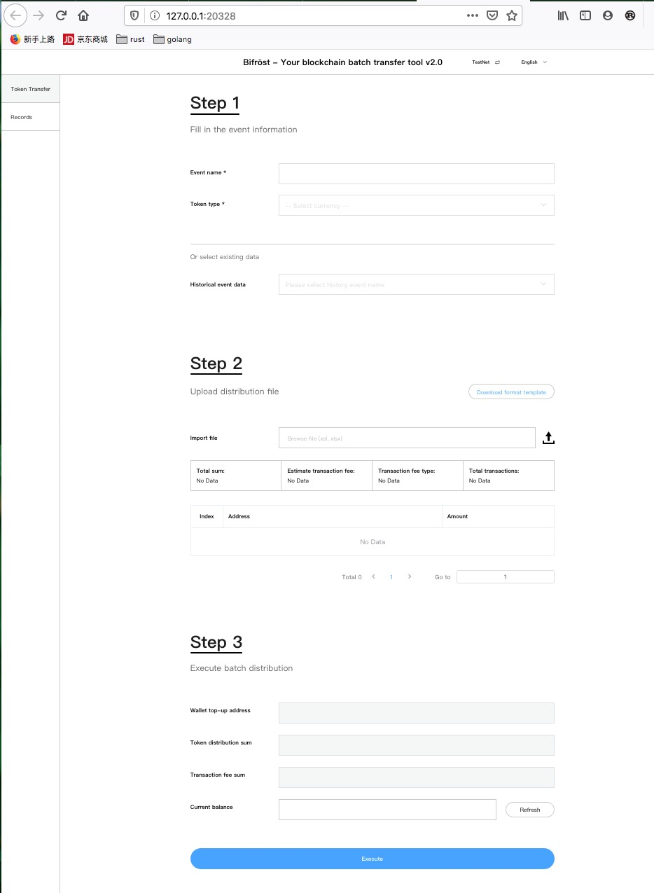

# 多币种分发工具教程

## 准备工作

请下载

1. 下载可执行文件
`mac`系统是二进制可执行文件
`windows`系统是`exe`文件

2. config.json文件
config.json文件示例
```json
{
  "rest_port":20327,
  "version":"1.0.0",
  "ont_cfg": {
    "rpc_addr_test_net":"http://polaris2.ont.io:20336",
    "rpc_addr_main_net":"http://dappnode1.ont.io:20336",
    "gas_price":2500,
    "gas_limit":20000
  },
  "eth_cfg":{
    "gas_price":20,
    "rpc_addr_test_net": "http://18.140.187.37:10331",
    "rpc_addr_main_net": "http://onto-eth.ont.io:10331"
  }
}
```
参数解释
* Ontology 配置参数
`rpc_addr_test_net` ontology链的测试网节点地址, 如果当前节点连不上,请换成其他节点
`rpc_addr_main_net` ontology链的主网节点地址, 如果当前节点连不上,请换成其他节点
`gas_price` 2500  交易的gas price, 需要大于或者等于2500
`gas_limit` 20000 交易的gas limit, 需要大于或者等于20000

* Eth 配置参数
`rpc_addr_test_net` Eth链的测试网节点地址, 如果当前节点连不上,请换成其他节点
`rpc_addr_main_net` Eth链的主网节点地址, 如果当前节点连不上,请换成其他节点
`gas_price`  交易的gas price, 默认是20, 单位是gwei,取值范围是10到100, 交易拥堵时建议取50， 交易不拥堵时可以取20

3. web文件夹
web文件夹存了前端的代码, 不需要做修改

## 使用步骤

* `mac`系统
在命令行执行可执行文件即可，浏览器会自动打开
* `windows`系统
双击 `bonus.exe`文件即可, 浏览器会自动打开 界面如下图


只需要按照图中的步骤操作即可.

## 需要特别注意的点
每次创建一个新的发币任务，会随机生成新的管理员地址，如果该发的币种是ERC20, 请先向该地址打一部分 `Eth`和 `Erc20`资产，手续费才能预测出来